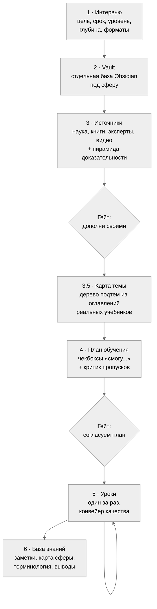
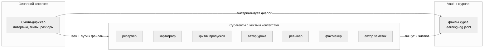
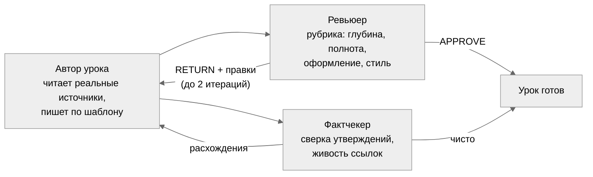

# learneverything

**Личный наставник в Claude Code: курс по любой теме — от интервью и научных источников до базы знаний в Obsidian.**

Скилл превращает Claude Code в систему глубокого обучения. Ты говоришь «хочу изучить X», дальше происходит вот что: интервью о цели и уровне, ресёрч источников с оценкой по пирамиде доказательности, карта темы из оглавлений реальных учебников, согласованный план, уроки с retrieval-практикой и повторениями по расписанию, и на выходе — отдельный Obsidian vault с конспектами, которые хочется перечитывать.

Вдохновлён [Bloom](https://github.com/Li-Evan/Bloom) и исследованием Бенджамина Блума «2 Sigma Problem» (1984): ученик с личным репетитором обгоняет класс на два стандартных отклонения. Личные репетиторы не масштабируются. Скиллы — масштабируются.

---

## Почему обычное «объясни мне X» в чате не работает

Три системные проблемы, и у каждой здесь есть конкретное лечение:

| Проблема | Что происходит | Лечение в learneverything |
|---|---|---|
| Пропуски тем | LLM пишет программу из усреднённой памяти и теряет целые разделы | Карта темы строится из оглавлений реальных учебников, отдельный критик с чистым контекстом ищет пропуски до старта уроков |
| Выдумки | Красивый текст без опоры на источники | Правило «нет источника — нет утверждения»: каждый факт со сноской на согласованный источник, фактчекер сверяет выборочно |
| Всё забывается | Прочитал, кивнул, через неделю пусто | Retrieval-вопросы вместо перечитывания, повторения по расписанию, понятие считается усвоенным после трёх успешных извлечений |

## Как это работает



Два гейта до первого урока: ты видишь источники и план, правишь их, и только потом начинается обучение. Внутри курса третий, опциональный гейт — квиз перед следующим уроком.

## Три слоя архитектуры



Принцип: всё, что рождается в разговоре, немедленно становится файлом. Субагенты не видят чат, они получают пути. Поэтому курс продолжается завтра, через неделю, из новой сессии с нулевым контекстом: скилл читает vault и журнал и знает, где вы остановились.

## Конвейер качества каждого урока



Автор и критики — всегда разные агенты: модель в собственном контексте не видит своих пробелов. Ревьюер и фактчекер работают параллельно.

## Что внутри урока

Каждый урок собран по механикам с сильнейшей доказательной базой (мета-анализы в [learning-science.md](skills/learneverything/references/learning-science.md)):

1. **Pretest** — 2–3 вопроса до контента: даже ошибочная попытка ответить повышает усвоение.
2. **Разбор прошлого урока** — оценка твоих ответов и разбор каждой пометки `???[что непонятно]`, которые ты ставишь прямо в тексте.
3. **Повторение по расписанию** — вопросы по уроку N−1 и N−3/N−4: интервал 10–20% от срока удержания.
4. **Контент с механизмами** — «почему и как работает», числа, формулы, границы применимости, сноска на источник у каждого факта, mermaid-схема у каждой абстракции.
5. **Миф и разбор** — refutation-блок: распространённое заблуждение, почему неверно, правильная модель.
6. **Что запомнить** — ёмкий итог в стиле Cornell.
7. **Проверь себя** — открытые вопросы, включая «объясни своими словами».
8. **Куда дальше** — 2–3 ранжированные рекомендации под твои форматы, видео с таймкодами.

Глубина по умолчанию экспертная: 2500–4000 слов плотного текста. Подача калибруется под твой уровень из профиля: новичку аналогии и постепенные термины, глубина при этом не режется. Скажешь «надо быстро и просто» — скилл снизит до рабочего знания или обзора.

## База знаний на выходе

```
~/Documents/learning/
├── learning-log.jsonl            журнал по всем сферам
└── Имя сферы/                    отдельный vault, открывается в Obsidian уже настроенным
    ├── Профиль ученика.md
    ├── Карта темы.md
    ├── Источники/                01 Научная база ... 04 Видео и курсы,
    │                             нумерация = пирамида доказательности
    ├── План обучения.md          чекбоксы «смогу...»
    ├── Уроки/
    ├── Понятия/                  атомарные заметки после каждого модуля
    ├── MOC.md                    карта сферы со связями
    ├── Терминология.md           словарь
    └── Практические выводы.md    что делать по-другому в жизни
```

Vault создаётся на сферу, то есть на широкую область знания. Тем внутри может быть сколько угодно: они живут модулями плана, и новая тема добавляется модулями в тот же vault, а не отдельной базой.

Читать можно не только в Obsidian: в интервью выбирается режим — Obsidian, чистый markdown или Notion. В режиме Notion курс зеркалится в страницы Notion через официальный [Notion MCP](https://developers.notion.com/docs/mcp) (callout-блоки, mermaid-схемы и структура подстраниц сохраняются), отвечать на вопросы уроков и ставить пометки `???` можно прямо там. Локальные файлы при этом остаются памятью курса.

Жирный шрифт в конспектах зарезервирован под слой выжимки: скольжение по жирному читается как краткий пересказ (Progressive Summarization). Кастомные callouts в Obsidian подсвечивают механики: «Проверь интуицию», «Миф и разбор», «Что запомнить».

## Установка

Нужен [Claude Code](https://claude.com/claude-code). Дальше:

```bash
git clone https://github.com/cryptoyoginya/learneverything.git
cd learneverything
cp -R skills/learneverything ~/.claude/skills/
cp agents/*.md ~/.claude/agents/
```

Проверка: новая сессия Claude Code, скажи «хочу изучить что-нибудь» — скилл подхватится сам.

### Опционально, для ещё лучшего обучения

- [superpowers](https://github.com/obra/superpowers) — скилл brainstorming вскрывает, чего ты на самом деле хочешь от темы, до составления плана.
- [deep-research](https://github.com/199-biotechnologies/claude-deep-research-skill) — глубокие погружения в спорные вопросы, где источники противоречат друг другу:

  ```bash
  git clone https://github.com/199-biotechnologies/claude-deep-research-skill.git ~/.claude/skills/deep-research
  ```

- Notion MCP — если хочешь вести конспекты в Notion вместо Obsidian:

  ```bash
  claude mcp add --transport http notion https://mcp.notion.com/mcp
  ```

Без них всё работает: скилл заменяет их обычными вопросами и веб-ресёрчем.

## Как пользоваться

| Ты говоришь | Что происходит |
|---|---|
| «Хочу изучить X» | Новый курс: интервью → источники → карта → план → первый урок |
| «Я прочитала», «следующий урок» | Разбор твоих ответов и `???`, потом следующий урок |
| `???[почему так?]` в тексте урока | Пометка разбирается в начале следующего урока |
| «Что я учу», «мой прогресс» | Сводка по всем сферам из журнала |
| «Надо быстро и просто» | Глубина снижается, механики остаются |

## Устройство репозитория

```
skills/learneverything/
├── SKILL.md                      дирижёр: пайплайн, гейты, оркестрация
├── SPEC.md                       полная спецификация с обоснованиями решений
└── references/
    ├── style-rules.md            живой русский, запреты ИИ-паттернов
    ├── design-system.md          шаблоны, callouts, типографика, mermaid
    ├── lesson-rubric.md          рубрика ревью урока
    ├── learning-science.md       механики и ссылки на мета-анализы
    ├── log-schema.md             схема журнала
    ├── templates/                скелеты всех документов курса
    └── obsidian-preset/          .obsidian для нового vault
agents/                           7 субагентов конвейера
```

## Благодарности

- [Li-Evan/Bloom](https://github.com/Li-Evan/Bloom) — механика «уроки-документы + пометки ???» и сама идея скилла-репетитора.
- Dunlosky, Bjork, Cepeda, Rawson, Mollick и другие исследователи обучения — список работ в [learning-science.md](skills/learneverything/references/learning-science.md).

## Лицензия

[MIT](LICENSE)
