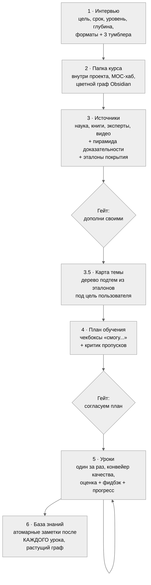
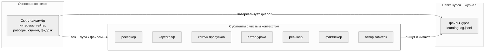
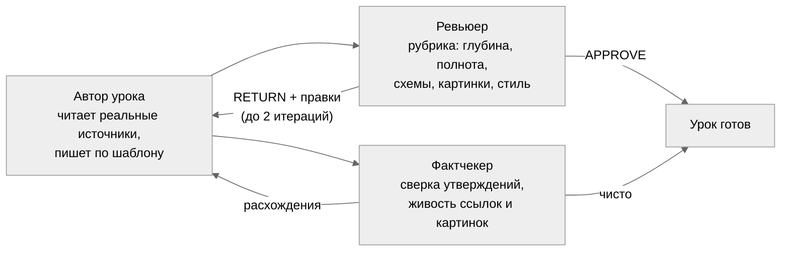
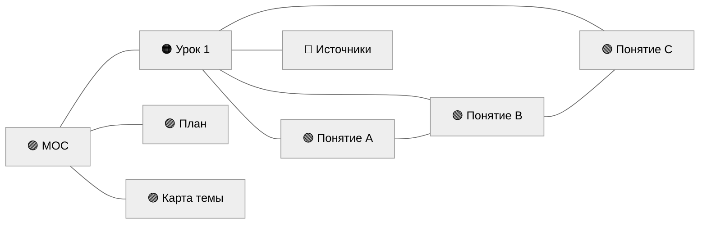
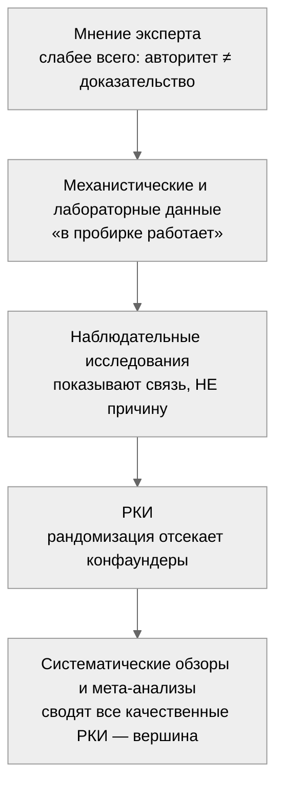

# learneverything

**Личный наставник в Claude Code: курс по любой теме — от интервью и научных источников до связного второго мозга в Obsidian.**

Скилл превращает Claude Code в систему глубокого обучения, построенную на доказательной науке обучения и многоагентной архитектуре. Ты говоришь «хочу изучить X» — дальше разворачивается полный конвейер: интервью о цели и уровне, ресёрч источников с оценкой по пирамиде доказательности, карта темы из реальных эталонов покрытия, согласованный план, уроки с retrieval-практикой и повторениями по расписанию, оценки и фидбэк по твоим ответам, и на выходе — растущая база знаний со связным графом понятий, которую хочется перечитывать.

Вдохновлён [Bloom](https://github.com/Li-Evan/Bloom) и работой Бенджамина Блума «2 Sigma Problem» (1984): ученик с личным репетитором обгоняет класс на два стандартных отклонения. Личные репетиторы не масштабируются. Скиллы — масштабируются.

---

## Философия: пять принципов, из которых выведено всё остальное

Скилл — это не «промпт, который пишет уроки». Это система с явными инженерными решениями, и каждое вытекает из принципа:

1. **Папка курса — общая память.** Всё, что рождается в диалоге, немедленно материализуется в файлы внутри рабочего проекта. Субагенты не видят чат — они получают пути к файлам. Поэтому курс продолжается завтра, через неделю, из новой сессии с нулевым контекстом: скилл читает файлы курса и журнал и точно знает, где ты остановилась.
2. **Диалог — в основном контексте, тяжёлое — субагентам.** Интервью, гейты, разбор ответов ведёт скилл-дирижёр. Ресёрч, карту темы, написание урока, ревью, фактчек, заметки — специализированные субагенты с чистым контекстом.
3. **Полнота не доверяется генерации.** LLM пишет программу из усреднённой памяти и систематически теряет разделы. Лечится картой темы из внешних эталонов покрытия + отдельным критиком пропусков с чистым контекстом ([CRITIC](https://openreview.net/forum?id=Sx038qxjek): модель в собственном контексте пробелов не видит).
4. **Нет источника — нет утверждения.** Уроки пишутся только по согласованному списку источников со сносками. Внешнее — с явной пометкой.
5. **Писатель и критик — всегда разные агенты.** Самопроверка в одном контексте не работает; критику дают искать пропуски, а не «оценивать своё».

## Почему обычное «объясни мне X» в чате не работает

Три системные проблемы, у каждой — конкретное лечение:

| Проблема | Что происходит | Лечение в learneverything |
|---|---|---|
| Пропуски тем | LLM пишет программу из усреднённой памяти и теряет целые разделы | Карта темы из эталонов покрытия — оглавлений учебников, программ курсов, blueprints сертификаций под цель пользователя; критик с чистым контекстом ищет пропуски до старта уроков |
| Выдумки | Красивый текст без опоры на источники | «Нет источника — нет утверждения»: каждый факт со сноской, фактчекер сверяет выборочно и проверяет живость ссылок |
| Всё забывается | Прочитал, кивнул, через неделю пусто | Retrieval-вопросы вместо перечитывания, повторения по расписанию, понятие усвоено после трёх успешных извлечений (successive relearning) |
| Мёртвые знания | Разрозненные конспекты, которые не связываются | Граф знаний: понятия — атомарные заметки, связанные `[[wikilink]]` друг с другом и с уроками, с раскрашенным графом в Obsidian |

## Как это работает: пайплайн



Два гейта до первого урока: ты видишь источники и план, правишь их, и только потом начинается обучение. Внутри курса третий, опциональный гейт — квиз перед следующим уроком.

## Три слоя архитектуры



Семь субагентов, у каждого — узкая роль и чистый контекст. Всё, что рождается в разговоре, немедленно становится файлом.

## Конвейер качества каждого урока



Автор и критики — всегда разные агенты. Ревьюер и фактчекер работают параллельно. **Этот конвейер — включаемый тумблером** (см. ниже): он даёт максимальное качество ценой токенов, и пользователь решает, когда он нужен.

## Персонализация: три тумблера, переключаемые в любой момент

Ключевое инженерное решение — вынести компромиссы «качество ↔ токены» и «строгость ↔ тепло» под контроль пользователя, причём не только на входе, а фразой в любой момент курса. Каждый тумблер — поле в `Профиль ученика.md`, действует со следующего урока.

| Тумблер | Что делает | Компромисс | Как переключить |
|---|---|---|---|
| **Проверки урока** | Запуск ревьюера + фактчекера после каждого урока | Качество против токенов и времени | «выключи / включи проверки» |
| **Картинки** | Поиск и вставка проверенных свободно-лицензионных иллюстраций там, где схема не тянет | Наглядность против токенов | «выключи / включи картинки» |
| **Оценки** | Оценка 1–10 по ответам на вопросы урока | Мотивация-измеримость (фидбэк остаётся всегда) | «ставь / не ставь оценки» |

Плюс из интервью: **квиз-гейт** (mastery-based progression — не пускать дальше без ответов), **глубина конспектов** (экспертная по умолчанию), **режим оформления** (Obsidian / чистый md / Notion).

## Что внутри урока

Каждый урок собран по механикам с сильнейшей доказательной базой (мета-анализы в [learning-science.md](skills/learneverything/references/learning-science.md)):

1. **Pretest** — 2–3 вопроса до контента: даже ошибочная попытка повышает усвоение (prequestion effect).
2. **Разбор прошлого урока** — фидбэк, оценка (если включена) и разбор каждой пометки `???[что непонятно]`, которые ты ставишь прямо в тексте.
3. **Повторение по расписанию** — вопросы по уроку N−1 и N−3/N−4: интервал 10–20% от срока удержания (Cepeda 2008).
4. **Контент с механизмами** — «почему и как работает», числа, формулы, границы применимости, сноска у каждого факта, mermaid-схема у каждой абстракции (dual coding).
5. **Миф и разбор** — refutation-блок: заблуждение → почему неверно → правильная модель (одна из сильнейших техник исправления ошибок).
6. **Что запомнить** — ёмкий итог в стиле Cornell.
7. **Проверь себя** — открытые вопросы, включая «объясни своими словами» (self-explanation).
8. **Куда дальше** — ранжированные рекомендации под твои форматы, видео с таймкодами.

Глубина по умолчанию экспертная: 2500–4000 слов плотного текста. Подача калибруется под уровень из профиля — новичку аналогии и постепенные термины, глубина при этом не режется.

## Обратная связь как отдельная механика

Фидбэк даётся **всегда**, независимо от тумблера оценок, и построен на двух принципах (полностью — в [feedback-and-grading.md](skills/learneverything/references/feedback-and-grading.md)):

- **Бутерброд** — начало и конец разговора с хорошего, разбор ошибок в середине.
- **Feedforward** — советы, как сделать лучше в следующий раз, вместо спора о прошлом. Не «ты ошибся здесь», а «в следующий раз свяжи X с Y — так будет точнее».

Оценка 1–10 (если включена) ставится по ответам за понимание механизмов — точность, глубина, связность, самостоятельность — и всегда стоит рядом с фидбэком, не голой цифрой. Динамика оценок пишется в журнал.

**После каждого урока — мотивационный блок:** процент пройденного (уроков + закрытые чекбоксы «смогу…») и 2–4 буллета «что нового ты узнала» с самыми яркими деталями. Топливо продолжать.

## Второй мозг: граф знаний, а не папка с файлами

Отдельные конспекты бесполезны — ценность в связях. Поэтому база знаний строится как граф с самого начала:

- **`MOC.md`** (Map of Content) создаётся сразу как центр графа и ссылается на профиль, карту, план, источники и все уроки.
- **Структурные файлы взаимно связаны** через `[[wikilink]]` — план ↔ карта ↔ источники ↔ уроки.
- **Уроки ставят `[[Понятие]]`** на ключевые термины прямо в тексте: узлы появляются в графе сразу, ещё до создания заметок.
- **Атомарные заметки понятий пишутся после КАЖДОГО урока** (не в конце модуля) — граф растёт постоянно. Каждая заметка перелинкована с соседними понятиями и обратной ссылкой на урок.
- **Граф в Obsidian раскрашен по типам узлов** (`obsidian-preset/graph.json`): 🟢 понятия · 🟠 уроки · 🔵 источники · 🟣 структура-хаб · ⚪ служебное. Не серая каша, а читаемая структура.



## Визуальная система

- **Mermaid-схемы** — костяк, рисуются всегда: к каждой абстракции содержательная схема рядом с текстом.
- **Настоящие картинки** (если тумблер включён) — только там, где схема принципиально не передаёт реальный вид (орган, тип кожи, животное, устройство). Только свободно-лицензионные (Wikimedia Commons, открытые атласы, public domain), с подписью и лицензией, проверенные на релевантность, локализуются в `Уроки/приложения/` для офлайн-доступа.
- **Видео с таймкодом** — прямо в теле урока там, где движущаяся картинка нужна для понимания, не только в «Куда дальше».

## База знаний на выходе

```
<рабочий проект>/
└── 🫁 Имя сферы/                отдельная папка курса, открывается в Obsidian настроенной
    ├── CLAUDE.md                самоописание курса для сессий Claude в этой папке
    ├── Профиль ученика.md       цель, уровень, тумблеры — источник правды о пользователе
    ├── Карта темы.md            дерево подтем из эталонов покрытия
    ├── Источники/               01 Научная база ... 04 Видео и курсы
    │                            (нумерация = пирамида доказательности) + Эталоны покрытия
    ├── План обучения.md         чекбоксы «смогу...»
    ├── Уроки/
    │   └── приложения/          локализованные картинки (офлайн-самодостаточность)
    ├── Понятия/                 атомарные заметки после каждого урока
    ├── MOC.md                   центр графа связей
    ├── Терминология.md          словарь
    └── Практические выводы.md   что делать по-другому в жизни

~/Documents/learning/learning-log.jsonl   глобальный журнал по всем сферам
```

Папка курса живёт **внутри рабочего проекта** — так файлы находятся через `@` и открываются по ⌘+click прямо в сессии Claude Code. Курс создаётся на сферу (широкую область знания): тем внутри может быть сколько угодно, они живут модулями плана, новая тема добавляется модулями в тот же курс.

Читать можно не только в Obsidian: в интервью выбирается режим — Obsidian, чистый markdown или Notion. В режиме Notion курс зеркалится в страницы через официальный [Notion MCP](https://developers.notion.com/docs/mcp). Локальные файлы всегда остаются памятью курса. Obsidian настраивается автоматически, и скилл явно показывает пользователю, как открыть vault (не «немой» реестр, а «Open folder as vault» + `obsidian://`-ссылка).

## Установка

Нужен [Claude Code](https://claude.com/claude-code). Дальше:

```bash
git clone https://github.com/cryptoyoginya/learneverything.git
cd learneverything
cp -R skills/learneverything ~/.claude/skills/
cp agents/*.md ~/.claude/agents/
```

Проверка: новая сессия Claude Code, скажи «хочу изучить что-нибудь» — скилл подхватится сам.

### Опционально, для ещё лучшего обучения

- [superpowers](https://github.com/obra/superpowers) — скилл brainstorming вскрывает, чего ты на самом деле хочешь от темы, до плана.
- [deep-research](https://github.com/199-biotechnologies/claude-deep-research-skill) — глубокие погружения в спорные вопросы:

  ```bash
  git clone https://github.com/199-biotechnologies/claude-deep-research-skill.git ~/.claude/skills/deep-research
  ```

- Notion MCP — если хочешь вести конспекты в Notion:

  ```bash
  claude mcp add --transport http notion https://mcp.notion.com/mcp
  ```

Без них всё работает: скилл заменяет их обычными вопросами и веб-ресёрчем.

## Как пользоваться

| Ты говоришь | Что происходит |
|---|---|
| «Хочу изучить X» | Новый курс: интервью → источники → карта → план → первый урок |
| «Я прочитала», «следующий урок» | Фидбэк, оценка, разбор `???`, потом следующий урок + прогресс |
| `???[почему так?]` в тексте урока | Пометка разбирается в начале следующего урока |
| «Выключи проверки / картинки», «не ставь оценки» | Переключает тумблер персонализации со следующего урока |
| «Что я учу», «мой прогресс» | Сводка по всем сферам из журнала |
| «Надо быстро и просто» | Глубина снижается, механики остаются |

## Научная основа

Скилл доказателен на двух уровнях сразу, и это разные вещи. **Как** он учит — по механикам с сильнейшей доказательной базой в исследованиях обучения. **Чему** он учит — по источникам, отранжированным по пирамиде доказательности, где мнение эксперта и мета-анализ лежат не на одной полке.

### Как учит: механики с доказанным эффектом

Не «прочитай и запомни», а техники, которые в мета-анализах обгоняют перечитывание. У каждой — механизм, почему работает, и работа, которая это показала.

| Механика | Почему работает | Доказательство |
|---|---|---|
| **Pretest** — вопросы до материала | Попытка ответить, даже неверно, готовит мозг заметить ответ в тексте | prequestion effect |
| **Retrieval-практика** — вопросы вместо перечитывания | Извлечение из памяти укрепляет след сильнее повторного ввода | testing effect, g ≈ 0.5–0.6 ([Adesope 2017](https://journals.sagepub.com/doi/abs/10.3102/0034654316689306)) |
| **Интервальные повторения** по расписанию | Забывание и повторное извлечение перестраивают память в долгую | оптимум 10–20% срока удержания ([Cepeda 2008](https://laplab.ucsd.edu/articles/Cepeda%20et%20al%202008_psychsci.pdf)) |
| **Successive relearning** — понятие усвоено после ≥3 извлечений | Разнесённое переучивание даёт стойкое удержание | [Rawson & Dunlosky 2022](https://journals.sagepub.com/doi/full/10.1177/09637214221100484) |
| **Refutation** — миф → почему неверно → верная модель | Прямое столкновение с заблуждением исправляет надёжнее, чем просто верный факт | [мета-анализ 2025](https://www.tandfonline.com/doi/abs/10.1080/00461520.2024.2365628) |
| **Self-explanation** — «объясни своими словами, почему X → Y» | Проговаривание вскрывает дыры в понимании | [Bisra 2018](https://link.springer.com/article/10.1007/s10648-018-9434-x) |
| **Worked examples с fading** — полный разбор → без шага → сам | Снимает перегрузку у новичка, убирается по мере роста | expertise reversal effect |
| **Желательная трудность** — сложнее ≠ хуже | Гладкость чтения обманывает: лёгкий текст ≠ усвоенный | [Bjork & Bjork 2020](https://www.waddesdonschool.com/wp-content/uploads/2021/02/Desriable-Difficulties-in-theory-and-practice-Bjork-Bjork-2020.pdf) |

Полный рейтинг техник — [Dunlosky et al. 2013](https://journals.sagepub.com/doi/abs/10.1177/1529100612453266); все работы собраны в [learning-science.md](skills/learneverything/references/learning-science.md).

И чего скилл принципиально не делает: перечитывание, конспект-пересказ, выделение маркером. Это техники с низкой доказательностью — приятно, но не работает. Их место занимают retrieval-задания.

### Чему учит: пирамида доказательности

Источник источнику рознь. В теме вроде питания на одно РКИ приходится сотня блогерских «одно исследование доказало». Скилл ранжирует всё, на что опирается, по пирамиде — от слабого к сильному:



Отсюда два железных правила:

- **Корреляция ≠ причинность.** «Кто ест X, реже болеет Y» не значит, что X лечит — может, такие люди просто в целом здоровее живут. В уроках это разводится явно.
- **Нет источника — нет утверждения.** Каждый факт — со сноской на конкретную работу; отдельный агент-фактчекер выборочно сверяет утверждения и проверяет, что ссылки живые.

Файлы источников в курсе так и нумеруются по пирамиде: `01 Научная база` (мета-анализы, гайдлайны) → `02 Книги` → `03 Эксперты и блоги` → `04 Видео`. Чем ниже номер, тем крепче доверие.

## Устройство репозитория

```
skills/learneverything/
├── SKILL.md                      дирижёр: пайплайн, гейты, оркестрация, тумблеры
├── SPEC.md                       полная спецификация с обоснованиями каждого решения
└── references/
    ├── style-rules.md            живой русский, запреты ИИ-паттернов
    ├── design-system.md          шаблоны, callouts, типографика, mermaid, граф, картинки
    ├── lesson-rubric.md          рубрика ревью урока
    ├── feedback-and-grading.md   оценка 1–10, бутерброд + feedforward, прогресс
    ├── learning-science.md       механики и ссылки на мета-анализы
    ├── log-schema.md             схема журнала (включая событие оценок)
    ├── templates/                скелеты всех документов курса
    └── obsidian-preset/          .obsidian для нового vault + цветной graph.json
agents/                           7 субагентов конвейера
```

## Благодарности

- [Li-Evan/Bloom](https://github.com/Li-Evan/Bloom) — механика «уроки-документы + пометки ???» и сама идея скилла-репетитора.
- Dunlosky, Bjork, Cepeda, Rawson, Mollick и другие исследователи обучения — список работ в [learning-science.md](skills/learneverything/references/learning-science.md).

## Лицензия

[MIT](LICENSE)
