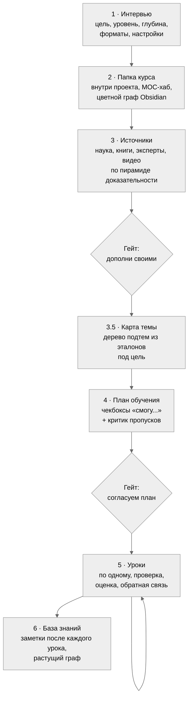
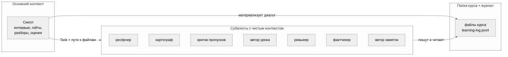
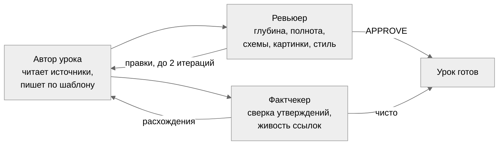
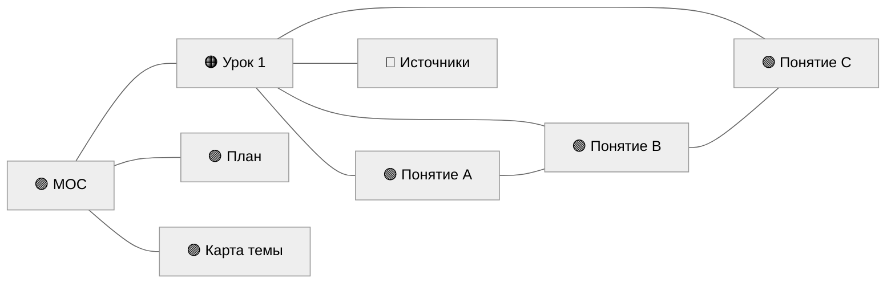
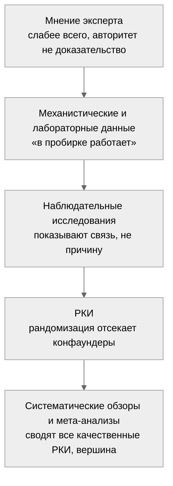

# learneverything

**Курс по любой теме с доказательной базой и проверенными подходами в обучении.**

Скажи «хочу изучить X». Остальное сделает скилл: интервью о цели и уровне, ресёрч источников с оценкой по пирамиде доказательности, карта темы из эталонов покрытия, согласованный план, уроки с retrieval-практикой и повторениями по расписанию, оценки и обратная связь по твоим ответам. На выходе растёт база знаний в Markdown, Obsidian или Notion.

---

## Персонализация

Курс настраивается под тебя в интервью. Вопросы задаются по одному, каждый меняет конкретную часть обучения.

| Вопрос | Пример ответа | На что влияет |
|---|---|---|
| Особенности обучения | «учусь на русском, термины дублируй на английском» | как подаётся материал, это учитывают все субагенты |
| Тема и зачем она тебе | «разобраться в питании, чтобы поменять рацион» | фокус курса и подбор примеров |
| Срок и интенсивность | «2 часа в неделю, за 3 месяца» | сколько модулей и как они разложены по неделям |
| Что уже знаешь | «с нуля» или «знаю базу химии» | сложность подачи и глубина разбора примеров |
| Форматы | «чтение, иногда видео» | что попадёт в блок «Куда дальше» |
| Глубина конспектов | «экспертная» или «быстро и просто» | плотность урока, от 2500–4000 слов до обзора |
| Квиз-гейт | «да» | пускать ли к следующему уроку без ответов на вопросы |
| Проверки урока | «да» | запуск ревьюера и фактчекера после урока, качество за токены |
| Картинки | «да» | вставка проверенных иллюстраций там, где схема не тянет |
| Оценки | «да» | оценка 1–10 по ответам, обратная связь даётся всегда |
| Оформление | «Obsidian» или «Notion» | где читать курс |

Последние четыре ответа переключаются фразой в любой момент: «выключи проверки», «не ставь оценки», «включи картинки». Меняется со следующего урока.

## Принципы

1. **Папка курса как память.** Всё из диалога сразу становится файлом внутри рабочего проекта. Субагенты не видят чат, они получают пути к файлам. Курс продолжается завтра, через неделю, из новой сессии: скилл читает файлы курса и журнал и знает, где ты остановилась.
2. **Диалог отдельно, тяжёлая работа отдельно.** Интервью, гейты, разбор ответов ведёт скилл. Ресёрч, карту темы, написание урока, ревью, фактчек, заметки делают субагенты с чистым контекстом.
3. **Полнота не доверяется генерации.** Модель пишет программу из усреднённой памяти и теряет разделы. Карта темы строится из внешних эталонов покрытия, а пропуски ищет отдельный критик с чистым контекстом.
4. **Нет источника, нет утверждения.** Уроки пишутся только по согласованному списку источников со сносками. Внешнее помечается явно.
5. **Автор и критик всегда разные агенты.** Самопроверка в одном контексте не ловит пробелы. Критику дают искать пропуски, а не оценивать своё.

## Что чат делает не так

| Проблема | Что происходит | Как решается |
|---|---|---|
| Пропуски тем | модель теряет целые разделы программы | карта темы из эталонов покрытия, критик пропусков до старта уроков |
| Выдумки | текст без опоры на источники | каждый факт со сноской, фактчекер сверяет выборочно и проверяет живость ссылок |
| Всё забывается | прочитал, кивнул, через неделю пусто | retrieval-вопросы, повторения по расписанию, понятие усвоено после трёх успешных извлечений |
| Мёртвые знания | разрозненные конспекты не связываются | граф знаний: понятия связаны `[[wikilink]]` друг с другом и с уроками |

## Пайплайн



Два гейта до первого урока: ты видишь источники и план, правишь их, и только потом начинается обучение. Третий гейт внутри курса опциональный, это квиз перед следующим уроком.

## Как устроено



Семь субагентов, у каждого узкая роль и чистый контекст. Всё из разговора сразу становится файлом.

## Проверка урока



Автор и проверяющие всегда разные агенты. Ревьюер и фактчекер идут параллельно. Проверки включаются тумблером и дают максимум качества за токены.

## Урок

Каждый урок собран по механикам с доказательной базой (мета-анализы в [learning-science.md](skills/learneverything/references/learning-science.md)):

1. **Pretest.** 2–3 вопроса до контента, даже неверная попытка повышает усвоение.
2. **Разбор прошлого урока.** Обратная связь, оценка (если включена), разбор каждой пометки `???[что непонятно]` из текста.
3. **Повторение по расписанию.** Вопросы по уроку N−1 и N−3/N−4, интервал 10–20% от срока удержания.
4. **Контент с механизмами.** «Почему и как работает», числа, формулы, границы применимости, сноска у каждого факта, схема у каждой абстракции.
5. **Миф и разбор.** Заблуждение, почему неверно, правильная модель.
6. **Что запомнить.** Ёмкий итог в стиле Cornell.
7. **Проверь себя.** Открытые вопросы, включая «объясни своими словами».
8. **Куда дальше.** Рекомендации под твои форматы, видео с таймкодами.

Глубина по умолчанию экспертная, 2500–4000 слов. Подача калибруется под уровень из профиля: новичку аналогии и постепенные термины, глубина при этом остаётся.

## Оценки и обратная связь

Обратная связь даётся всегда, независимо от тумблера оценок. Две механики (подробно в [feedback-and-grading.md](skills/learneverything/references/feedback-and-grading.md)):

- **Бутерброд.** Начало и конец разговора с хорошего, разбор ошибок в середине.
- **Feedforward.** Как сделать лучше в следующий раз, без разбора вины за прошлое.

Оценка 1–10 (если включена) ставится за понимание механизмов и стоит рядом с обратной связью, а не голой цифрой. После каждого урока идёт прогресс: процент пройденного и 2–4 пункта о том, что нового ты узнала.

## Граф знаний

Ценность базы в связях, а не в отдельных файлах. Граф строится с самого начала:

- **`MOC.md`** создаётся сразу как центр графа и ссылается на профиль, карту, план, источники и уроки.
- **Структурные файлы связаны** через `[[wikilink]]`.
- **Уроки ставят `[[Понятие]]`** на ключевые термины, узлы появляются в графе сразу.
- **Заметки понятий пишутся после каждого урока**, граф растёт постоянно.
- **Граф в Obsidian раскрашен по типам:** 🟢 понятия, 🟠 уроки, 🔵 источники, 🟣 структура, ⚪ служебное.



## Визуал

- **Схемы Mermaid** рисуются всегда, к каждой абстракции.
- **Настоящие картинки** (если тумблер включён) там, где схема не передаёт реальный вид. Только свободные лицензии, с подписью, сохраняются локально для офлайна.
- **Видео с таймкодом** прямо в тексте урока, где нужно увидеть движение.

## Структура курса

```
<рабочий проект>/
└── 🫁 Имя сферы/                папка курса, открывается в Obsidian настроенной
    ├── CLAUDE.md                самоописание курса для сессий Claude
    ├── Профиль ученика.md       цель, уровень, настройки
    ├── Карта темы.md            дерево подтем из эталонов покрытия
    ├── Источники/               01 Научная база ... 04 Видео + Эталоны покрытия
    ├── План обучения.md         чекбоксы «смогу...»
    ├── Уроки/
    │   └── приложения/          локализованные картинки
    ├── Понятия/                 атомарные заметки после каждого урока
    ├── MOC.md                   центр графа связей
    ├── Терминология.md          словарь
    └── Практические выводы.md   что делать по-другому в жизни

~/Documents/learning/learning-log.jsonl   журнал по всем сферам
```

Папка курса живёт внутри рабочего проекта, поэтому файлы находятся через `@` и открываются по ⌘+click прямо в сессии. Курс создаётся на сферу, тем внутри может быть сколько угодно, они живут модулями плана. Читать можно в Obsidian, чистом markdown или Notion (зеркалирование через [Notion MCP](https://developers.notion.com/docs/mcp)).

## Установка

Нужен [Claude Code](https://claude.com/claude-code).

```bash
git clone https://github.com/cryptoyoginya/learneverything.git
cd learneverything
cp -R skills/learneverything ~/.claude/skills/
cp agents/*.md ~/.claude/agents/
```

Проверка: новая сессия Claude Code, скажи «хочу изучить что-нибудь», скилл подхватится сам.

### Опционально

- [superpowers](https://github.com/obra/superpowers): скилл brainstorming помогает понять, чего ты хочешь от темы, до плана.
- [deep-research](https://github.com/199-biotechnologies/claude-deep-research-skill): погружения в спорные вопросы.

  ```bash
  git clone https://github.com/199-biotechnologies/claude-deep-research-skill.git ~/.claude/skills/deep-research
  ```

- Notion MCP, если хочешь вести конспекты в Notion:

  ```bash
  claude mcp add --transport http notion https://mcp.notion.com/mcp
  ```

Без них всё работает: скилл заменяет их обычными вопросами и веб-ресёрчем.

## Команды

| Ты говоришь | Что происходит |
|---|---|
| «Хочу изучить X» | новый курс: интервью, источники, карта, план, первый урок |
| «Я прочитала», «следующий урок» | обратная связь, оценка, разбор `???`, следующий урок, прогресс |
| `???[почему так?]` в тексте | пометка разбирается в начале следующего урока |
| «Выключи проверки», «не ставь оценки» | переключает настройку со следующего урока |
| «Что я учу», «мой прогресс» | сводка по всем сферам из журнала |
| «Надо быстро и просто» | глубина снижается, механики остаются |

## Устройство и архитектура

Раздел для тех, кто хочет понять, как это собрано внутри. Полная спецификация с обоснованием каждого решения в [SPEC.md](skills/learneverything/SPEC.md).

### Раскладка репозитория

```
skills/learneverything/
├── SKILL.md                      дирижёр: пайплайн, гейты, оркестрация, настройки
├── SPEC.md                       спецификация с обоснованием решений
└── references/
    ├── style-rules.md            живой русский, запреты ИИ-паттернов
    ├── design-system.md          шаблоны, callouts, типографика, схемы, граф, картинки
    ├── lesson-rubric.md          рубрика ревью урока
    ├── feedback-and-grading.md   шкала 1–10, бутерброд, feedforward, прогресс
    ├── learning-science.md       механики и ссылки на мета-анализы
    ├── log-schema.md             схема журнала событий
    ├── templates/                скелеты профиля, урока, заметки, MOC, терминологии
    └── obsidian-preset/          appearance.json, css, цветной graph.json
agents/                           7 субагентов конвейера

~/Documents/learning/learning-log.jsonl   глобальный журнал по всем сферам
<рабочий проект>/<Имя сферы>/             папка курса, память конкретного курса
```

### Модель оркестрации

Скилл работает как дирижёр в основном контексте. Тяжёлую работу он раздаёт субагентам через Task. Субагенты не видят диалог, они получают пути к файлам и пишут результат обратно в файлы. Это держит основной контекст лёгким и делает каждый шаг воспроизводимым.

| Субагент | Вход | Выход |
|---|---|---|
| ресёрчер | тема, профиль | 4 файла источников по пирамиде + эталоны покрытия |
| картограф | эталоны покрытия, профиль | `Карта темы.md`, дерево подтем с пометками цели |
| критик пропусков | план, карта, эталоны, профиль | список пропусков «критично / периферийно» |
| автор урока | профиль, план, карта, источники, прошлый урок | файл урока по шаблону, со сносками и схемами |
| ревьюер | урок, рубрика | APPROVE или список правок |
| фактчекер | урок, источники | сверка утверждений, отчёт по живости ссылок |
| автор заметок | урок, карта, профиль | атомарные заметки, обновление MOC и терминологии |

Автор и проверяющие всегда разные агенты: модель в собственном контексте не видит своих пробелов, поэтому критику нужен чистый контекст.

### Персистентность и возобновление

Всё из диалога сразу становится файлом. Состояние курса не живёт в контексте модели, оно живёт на диске:

- **Файлы курса** это память: профиль, карта, план, уроки, заметки.
- **`learning-log.jsonl`** это журнал событий, только на дозапись, общий для всех сфер. События: `lesson_done`, `quiz_gate`, `gate_skip`, `retrieval`, `graded`, `module_done`, `course_event`.
- **`CLAUDE.md`** в папке курса делает курс самоописываемым для любой сессии.

Новая сессия с нулевым контекстом читает журнал и файлы курса и продолжает с точки остановки. Схема журнала в [log-schema.md](skills/learneverything/references/log-schema.md).

### Интервальные повторения как состояние

Повторения это не разовая вставка, а машина состояний поверх журнала. Каждое понятие держит счётчик успешных извлечений (`streak`) в разных сессиях. Порог усвоения `streak ≥ 3` снимает понятие с расписания (successive relearning). Неудача сбрасывает счётчик. Обход квиз-гейта пишется событием `gate_skip`, и невзятые понятия возвращаются в расписание с повышенным приоритетом.

### Гейты и настройки

Три гейта останавливают конвейер на согласование с человеком: после источников, после плана, и опциональный квиз перед следующим уроком. Настройки (проверки, картинки, оценки, квиз-гейт, глубина, оформление) это поля в `Профиль ученика.md`, единственном источнике правды о пользователе для субагентов. Четыре из них переключаются фразой в любой момент и действуют со следующего урока.

### Контроль качества

Оформление проверяется рубрикой так же формально, как контент. Правило «нет источника, нет утверждения» держит фактуру на согласованном списке, фактчекер сверяет выборочно и проверяет живость ссылок. Стиль каждого текста проходит через `style-rules.md` с запретом ИИ-паттернов.

## Научная основа

Скилл доказателен на двух уровнях, и это разные вещи. **Как** он учит по механикам с сильнейшей доказательной базой в исследованиях обучения. **Чему** он учит по источникам, отранжированным по пирамиде доказательности, где мнение эксперта и мета-анализ лежат не на одной полке.

### Как учит

Не «прочитай и запомни», а техники, которые в мета-анализах обгоняют перечитывание. У каждой механизм, почему работает, и работа, которая это показала.

| Механика | Почему работает | Доказательство |
|---|---|---|
| **Pretest**, вопросы до материала | попытка ответить готовит мозг заметить ответ в тексте | prequestion effect |
| **Retrieval-практика**, вопросы вместо перечитывания | извлечение из памяти укрепляет след сильнее повторного ввода | testing effect, g ≈ 0.5–0.6 ([Adesope 2017](https://journals.sagepub.com/doi/abs/10.3102/0034654316689306)) |
| **Интервальные повторения** по расписанию | забывание и повторное извлечение перестраивают память в долгую | оптимум 10–20% срока удержания ([Cepeda 2008](https://laplab.ucsd.edu/articles/Cepeda%20et%20al%202008_psychsci.pdf)) |
| **Successive relearning**, усвоено после ≥3 извлечений | разнесённое переучивание даёт стойкое удержание | [Rawson & Dunlosky 2022](https://journals.sagepub.com/doi/full/10.1177/09637214221100484) |
| **Refutation**, миф и разбор | столкновение с заблуждением исправляет надёжнее верного факта | [мета-анализ 2025](https://www.tandfonline.com/doi/abs/10.1080/00461520.2024.2365628) |
| **Self-explanation**, «объясни своими словами» | проговаривание вскрывает дыры в понимании | [Bisra 2018](https://link.springer.com/article/10.1007/s10648-018-9434-x) |
| **Worked examples с fading** | снимает перегрузку у новичка, убирается по мере роста | expertise reversal effect |
| **Желательная трудность** | гладкость чтения обманывает, лёгкий текст не значит усвоенный | [Bjork & Bjork 2020](https://www.waddesdonschool.com/wp-content/uploads/2021/02/Desriable-Difficulties-in-theory-and-practice-Bjork-Bjork-2020.pdf) |

Полный рейтинг техник в [Dunlosky et al. 2013](https://journals.sagepub.com/doi/abs/10.1177/1529100612453266), все работы собраны в [learning-science.md](skills/learneverything/references/learning-science.md).

Чего скилл не делает: перечитывание, конспект-пересказ, выделение маркером. Низкая доказательность, их место занимают retrieval-задания.

### Чему учит

Источник источнику рознь. В теме вроде питания на одно РКИ приходится сотня блогерских «одно исследование доказало». Скилл ранжирует всё, на что опирается, по пирамиде от слабого к сильному:



Отсюда два правила:

- **Корреляция не причинность.** «Кто ест X, реже болеет Y» не значит, что X лечит, может, такие люди в целом здоровее живут. В уроках это разводится явно.
- **Нет источника, нет утверждения.** Каждый факт со сноской на конкретную работу, фактчекер сверяет выборочно и проверяет живость ссылок.

Файлы источников в курсе нумеруются по пирамиде: `01 Научная база` (мета-анализы, гайдлайны), `02 Книги`, `03 Эксперты и блоги`, `04 Видео`. Чем ниже номер, тем крепче доверие.

## Благодарности

Dunlosky, Bjork, Cepeda, Rawson, Mollick и другие исследователи обучения. Работы собраны в [learning-science.md](skills/learneverything/references/learning-science.md).

## Лицензия

[MIT](LICENSE)
