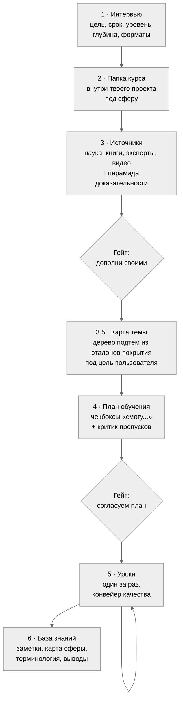
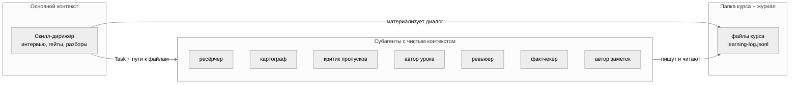
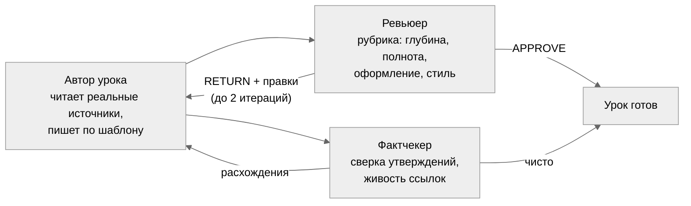
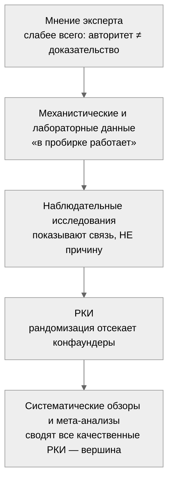

# learneverything

**Личный наставник в Claude Code: курс по любой теме — от интервью и научных источников до базы знаний прямо в твоём проекте.**

Скилл превращает Claude Code в систему глубокого обучения. Ты говоришь «хочу изучить X», дальше происходит вот что: интервью о цели и уровне, ресёрч источников с оценкой по пирамиде доказательности, карта темы из эталонов покрытия, согласованный план, уроки с retrieval-практикой и повторениями по расписанию, и на выходе — папка курса с конспектами прямо в твоём проекте (открываются по ⌘+click, при желании — в Obsidian), которые хочется перечитывать.

Вдохновлён [Bloom](https://github.com/Li-Evan/Bloom) и исследованием Бенджамина Блума «2 Sigma Problem» (1984): ученик с личным репетитором обгоняет класс на два стандартных отклонения. Личные репетиторы не масштабируются. Скиллы — масштабируются.

---

## Почему обычное «объясни мне X» в чате не работает

Три системные проблемы, и у каждой здесь есть конкретное лечение:

| Проблема | Что происходит | Лечение в learneverything |
|---|---|---|
| Пропуски тем | LLM пишет программу из усреднённой памяти и теряет целые разделы | Карта темы строится из эталонов покрытия — оглавлений учебников, программ курсов, blueprints сертификаций, выбранных под цель пользователя; отдельный критик с чистым контекстом ищет пропуски до старта уроков |
| Выдумки | Красивый текст без опоры на источники | Правило «нет источника — нет утверждения»: каждый факт со сноской на согласованный источник, фактчекер сверяет выборочно |
| Всё забывается | Прочитал, кивнул, через неделю пусто | Retrieval-вопросы вместо перечитывания, повторения по расписанию, понятие считается усвоенным после трёх успешных извлечений |

## Как это работает



Два гейта до первого урока: ты видишь источники и план, правишь их, и только потом начинается обучение. Внутри курса третий, опциональный гейт — квиз перед следующим уроком.

## Три слоя архитектуры



Принцип: всё, что рождается в разговоре, немедленно становится файлом. Субагенты не видят чат, они получают пути. Поэтому курс продолжается завтра, через неделю, из новой сессии с нулевым контекстом: скилл читает файлы курса и журнал и знает, где вы остановились.

## Конвейер качества каждого урока



Автор и критики — всегда разные агенты: модель в собственном контексте не видит своих пробелов. Ревьюер и фактчекер работают параллельно.

## Что внутри урока

Каждый урок собран по механикам с сильнейшей доказательной базой (мета-анализы в [learning-science.md](skills/learneverything/references/learning-science.md)):

1. **Pretest** — 2–3 вопроса до контента: даже ошибочная попытка ответить повышает усвоение.
2. **Разбор прошлого урока** — оценка твоих ответов и разбор каждой пометки `???[что непонятно]`, которые ты ставишь прямо в тексте.
3. **Повторение по расписанию** — вопросы по уроку N−1 и N−3/N−4: интервал 10–20% от срока удержания.
4. **Контент с механизмами** — «почему и как работает», числа, формулы, границы применимости, сноска на источник у каждого факта, mermaid-схема у каждой абстракции.
5. **Миф и разбор** — refutation-блок: распространённое заблуждение, почему неверно, правильная модель.
6. **Что запомнить** — ёмкий итог в стиле Cornell.
7. **Проверь себя** — открытые вопросы, включая «объясни своими словами».
8. **Куда дальше** — 2–3 ранжированные рекомендации под твои форматы, видео с таймкодами.

Глубина по умолчанию экспертная: 2500–4000 слов плотного текста. Подача калибруется под твой уровень из профиля: новичку аналогии и постепенные термины, глубина при этом не режется. Скажешь «надо быстро и просто» — скилл снизит до рабочего знания или обзора.

## Научная основа

Скилл доказателен на двух уровнях сразу, и это разные вещи. **Как** он учит — по механикам с сильнейшей доказательной базой в исследованиях обучения. **Чему** он учит — по источникам, отранжированным по пирамиде доказательности, где мнение эксперта и мета-анализ лежат не на одной полке.

### Как учит: механики с доказанным эффектом

Не «прочитай и запомни», а техники, которые в мета-анализах обгоняют перечитывание. У каждой — механизм, почему работает, и работа, которая это показала.

| Механика | Почему работает | Доказательство |
|---|---|---|
| **Pretest** — вопросы до материала | Попытка ответить, даже неверно, готовит мозг заметить ответ в тексте | prequestion effect |
| **Retrieval-практика** — вопросы вместо перечитывания | Извлечение из памяти укрепляет след сильнее повторного ввода | testing effect, g ≈ 0.5–0.6 ([Adesope 2017](https://journals.sagepub.com/doi/abs/10.3102/0034654316689306)) |
| **Интервальные повторения** по расписанию | Забывание и повторное извлечение перестраивают память в долгую | оптимум 10–20% срока удержания ([Cepeda 2008](https://laplab.ucsd.edu/articles/Cepeda%20et%20al%202008_psychsci.pdf)) |
| **Successive relearning** — понятие усвоено после ≥3 извлечений | Разнесённое переучивание даёт стойкое удержание | [Rawson & Dunlosky 2022](https://journals.sagepub.com/doi/full/10.1177/09637214221100484) |
| **Refutation** — миф → почему неверно → верная модель | Прямое столкновение с заблуждением исправляет надёжнее, чем просто верный факт | [мета-анализ 2025](https://www.tandfonline.com/doi/abs/10.1080/00461520.2024.2365628) |
| **Self-explanation** — «объясни своими словами, почему X → Y» | Проговаривание вскрывает дыры в понимании | [Bisra 2018](https://link.springer.com/article/10.1007/s10648-018-9434-x) |
| **Worked examples с fading** — полный разбор → без шага → сам | Снимает перегрузку у новичка, убирается по мере роста | expertise reversal effect |
| **Желательная трудность** — сложнее ≠ хуже | Гладкость чтения обманывает: лёгкий текст ≠ усвоенный | [Bjork & Bjork 2020](https://www.waddesdonschool.com/wp-content/uploads/2021/02/Desriable-Difficulties-in-theory-and-practice-Bjork-Bjork-2020.pdf) |

Полный рейтинг техник — [Dunlosky et al. 2013](https://journals.sagepub.com/doi/abs/10.1177/1529100612453266); все работы собраны в [learning-science.md](skills/learneverything/references/learning-science.md).

И чего скилл принципиально не делает: перечитывание, конспект-пересказ, выделение маркером. Это техники с низкой доказательностью — приятно, но не работает. Их место занимают retrieval-задания.

### Чему учит: пирамида доказательности

Источник источнику рознь. В теме вроде питания на одно РКИ приходится сотня блогерских «одно исследование доказало». Скилл ранжирует всё, на что опирается, по пирамиде — от слабого к сильному:



Отсюда два железных правила:

- **Корреляция ≠ причинность.** «Кто ест X, реже болеет Y» не значит, что X лечит — может, такие люди просто в целом здоровее живут. В уроках это разводится явно.
- **Нет источника — нет утверждения.** Каждый факт — со сноской на конкретную работу; отдельный агент-фактчекер выборочно сверяет утверждения и проверяет, что ссылки живые.

Файлы источников в курсе так и нумеруются по пирамиде: `01 Научная база` (мета-анализы, гайдлайны) → `02 Книги` → `03 Эксперты и блоги` → `04 Видео`. Чем ниже номер, тем крепче доверие.

## База знаний на выходе

```
<твой проект>/                    папка, где открыт Claude Code
└── Имя сферы/                    курс лежит внутри проекта — файлы находятся
    │                             через @ и открываются по ⌘+click
    ├── CLAUDE.md                 самоописание курса для сессий Claude в этой папке
    ├── Профиль ученика.md
    ├── Карта темы.md
    ├── Источники/                01 Научная база ... 04 Видео и курсы,
    │                             нумерация = пирамида доказательности
    ├── План обучения.md          чекбоксы «смогу...»
    ├── Уроки/
    ├── Понятия/                  атомарные заметки после каждого модуля
    ├── MOC.md                    карта сферы со связями
    ├── Терминология.md           словарь
    └── Практические выводы.md    что делать по-другому в жизни

~/Documents/learning/learning-log.jsonl    глобальный журнал по всем сферам
```

Папка курса создаётся на сферу, то есть на широкую область знания. Тем внутри может быть сколько угодно: они живут модулями плана, и новая тема добавляется модулями в ту же папку, а не отдельной базой.

База всегда одна — markdown-файлы в папке курса, они находятся через `@` и открываются по ⌘+click прямо в Claude Code. В интервью отдельно спрашивается, нужен ли поверх **Obsidian** (тогда та же папка регистрируется как vault с преднастроенным оформлением), и отдельно — зеркало в **Notion** через официальный [Notion MCP](https://developers.notion.com/docs/mcp) (callout-блоки, mermaid-схемы и структура подстраниц сохраняются), отвечать на вопросы уроков и ставить пометки `???` можно прямо там. Локальные файлы при этом остаются памятью курса.

Жирный шрифт в конспектах зарезервирован под слой выжимки: скольжение по жирному читается как краткий пересказ (Progressive Summarization). Кастомные callouts в Obsidian подсвечивают механики: «Проверь интуицию», «Миф и разбор», «Что запомнить».

## Установка

Нужен [Claude Code](https://claude.com/claude-code). Дальше:

```bash
git clone https://github.com/cryptoyoginya/learneverything.git
cd learneverything
cp -R skills/learneverything ~/.claude/skills/
cp agents/*.md ~/.claude/agents/
```

Проверка: новая сессия Claude Code, скажи «хочу изучить что-нибудь» — скилл подхватится сам.

### Опционально, для ещё лучшего обучения

- [superpowers](https://github.com/obra/superpowers) — скилл brainstorming вскрывает, чего ты на самом деле хочешь от темы, до составления плана.
- [deep-research](https://github.com/199-biotechnologies/claude-deep-research-skill) — глубокие погружения в спорные вопросы, где источники противоречат друг другу:

  ```bash
  git clone https://github.com/199-biotechnologies/claude-deep-research-skill.git ~/.claude/skills/deep-research
  ```

- Notion MCP — если хочешь зеркалить конспекты в Notion:

  ```bash
  claude mcp add --transport http notion https://mcp.notion.com/mcp
  ```

Без них всё работает: скилл заменяет их обычными вопросами и веб-ресёрчем.

## Как пользоваться

| Ты говоришь | Что происходит |
|---|---|
| «Хочу изучить X» | Новый курс: интервью → источники → карта → план → первый урок |
| «Я прочитала», «следующий урок» | Разбор твоих ответов и `???`, потом следующий урок |
| `???[почему так?]` в тексте урока | Пометка разбирается в начале следующего урока |
| «Что я учу», «мой прогресс» | Сводка по всем сферам из журнала |
| «Надо быстро и просто» | Глубина снижается, механики остаются |

## Устройство репозитория

```
skills/learneverything/
├── SKILL.md                      дирижёр: пайплайн, гейты, оркестрация
├── SPEC.md                       полная спецификация с обоснованиями решений
└── references/
    ├── style-rules.md            живой русский, запреты ИИ-паттернов
    ├── design-system.md          шаблоны, callouts, типографика, mermaid
    ├── lesson-rubric.md          рубрика ревью урока
    ├── learning-science.md       механики и ссылки на мета-анализы
    ├── log-schema.md             схема журнала
    ├── templates/                скелеты всех документов курса
    └── obsidian-preset/          .obsidian для нового vault
agents/                           7 субагентов конвейера
```

## Благодарности

- [Li-Evan/Bloom](https://github.com/Li-Evan/Bloom) — механика «уроки-документы + пометки ???» и сама идея скилла-репетитора.
- Dunlosky, Bjork, Cepeda, Rawson, Mollick и другие исследователи обучения — список работ в [learning-science.md](skills/learneverything/references/learning-science.md).

## Лицензия

[MIT](LICENSE)
