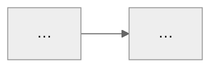

<!-- Скелет урока. Порядок блоков фиксированный. Все комментарии-инструкции при генерации удалить. -->
<!-- Режим «чистый md»: callouts заменить на стандартные GitHub alerts: pretest/recall→[!TIP], myth→[!WARNING], core→[!IMPORTANT], outside→[!CAUTION], next→[!NOTE]; wikilinks→обычный текст или md-ссылки. -->

# NN. Название урока

Модуль: <модуль из Плана обучения> · Узлы карты: <какие узлы Карты темы закрывает> · ~NN минут чтения

> [!pretest] Проверь интуицию
> <!-- 2–3 вопроса ДО контента, на интуицию и здравый смысл, не на термины. Ответы не даются — они всплывут в тексте. -->
> 1. …
> 2. …

## Разбор прошлого урока

<!-- Со второго урока. Первый урок: блок отсутствует целиком. -->

### Твои ответы

<!-- По каждому вопросу прошлого урока: ✅ верно / ⚠️ частично / ❌ мимо, короткое пояснение и правильный ответ. Не отвечал — так и написать, дать ответ. -->

### Твои ???

<!-- Каждую ???-пометку процитировать и разобрать по существу. Пометок не было: «В прошлом уроке пометок не было». -->

### Повторение

> [!recall] Из прошлых уроков
> <!-- retrieval-вопросы по расписанию из задания: урок N−1, уроки N−3/N−4, хвосты из gate_skip. Открытые вопросы, место для ответа. -->

## <Содержательный заголовок первой части>

<!-- Контент. Правила: каждое фактическое утверждение — сноска [^n] на согласованный источник. Механизмы, числа, границы применимости. Жирным — только то, что войдёт в выжимку при повторном чтении. Абзацы 2–4 предложения. -->

<!-- К каждой абстрактной концепции — одна содержательная схема, ≤10 узлов. -->

## <Вторая часть…>

> [!myth] Миф и разбор
> <!-- Только если по теме есть реально распространённый миф: миф → почему неверно (с источником) → правильная модель. Нет мифа — блок убрать. -->

> [!outside] Этого не было в твоих источниках
> <!-- Только если пришлось отвечать через веб-поиск сверх согласованного списка. Иначе убрать. -->

> [!core] Что запомнить
> <!-- 3–5 ёмких строк, ядро урока. Cornell-итог. -->

## Проверь себя

> [!recall] Вопросы этого урока
> <!-- Открытые вопросы по уроку, включая минимум один «объясни своими словами, почему…» и, для процедурных тем, задачу с расчётом. Место для ответов. Практика — с interleaving: смешать с одной задачей смежной темы, если понятия легко спутать. -->
> 1. …
>
>    Твой ответ:
> 2. …
>
>    Твой ответ:

<!-- Квиз-гейт включён в Профиле: добавить строку «Следующий урок откроется после твоих ответов — без подглядывания в текст». Выключен: «Ответишь — разберём в следующем уроке». -->

> [!next] Куда дальше
> <!-- 2–3 рекомендации, ранжированы: первая — «обязательная для глубины», остальные опциональные. Формат: ссылка-сноска, тип (углубление/расширение/другой формат), время, что узнаешь и почему после этого урока. Видео — с таймкодами. Форматы — по предпочтениям Профиля. -->

## Твоя обратная связь

<!-- Пустой блок для пользователя. -->
Пиши сюда вопросы, несогласия, чего не хватило. В любом месте текста можно ставить пометки `???[что непонятно]` — разберу в следующем уроке.

[^1]: <Источник из согласованного списка, страница/раздел/таймкод>
